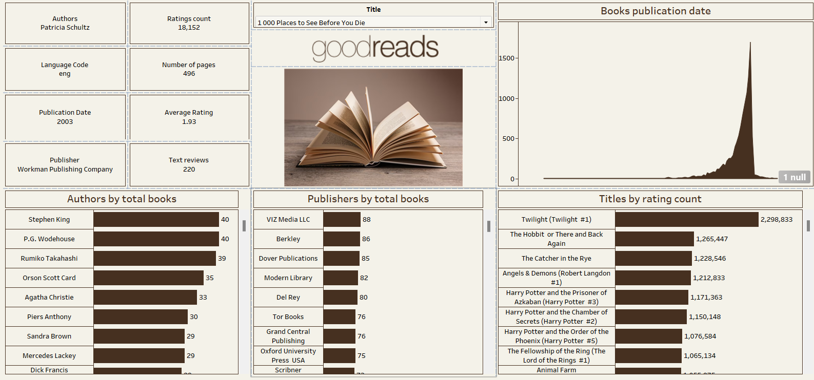

# Goodreads Data Analysis 📊  
This project analyzes Goodreads data using Tableau. It visualizes book ratings, author statistics, and publisher trends.  

## 📌 Key Insights  
- Top-rated books and authors  
- Trends in book publications over time  
- Most popular publishers  

## 🔧 Tools Used  
- **Tableau** for visualization  
- **Dataset** from Goodreads  

## 🖥️ Dashboard Preview  
  

## 📂 Files Included  
- `Goodreads_Dashboard.twbx` (Tableau workbook)  
- `dataset.csv` (Original dataset)  
- `goodbook.png` (Dashboard screenshot)  
